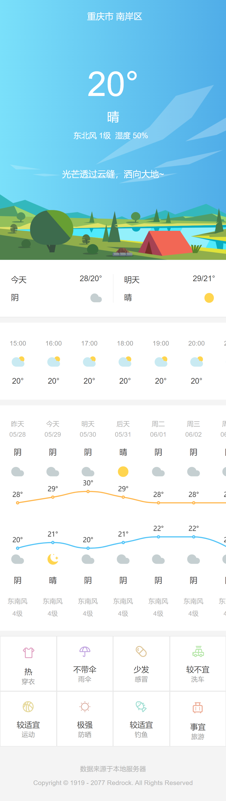

## Introduction

This is an imatation of the [Tencent Weather](https://xw.tianqi.qq.com/) of mobile web version. Considering the high cost of weather API, here I just used koa to write a simple server which can respond with the mock data. You can get API documentions [here](#API).

## Preview

### Loading Screen


### Main Screen


## Features

### Client End

- `Webpack`
	- Code Split
- `React`
	- Functionnal Components, Hooks, React 17 JSX Tranform
	- CSS in JS
	- Flux (Hooks)
- `Typescript`
- `Babel`
- `ECharts`
- Progressive Web Application
    - App Manifest
    - Offline Cache

### Server End

- `Koa 2`
- ~~Mock Data~~

## Installation

```bash
git clone git@github.com:lomirus/tencent-weather.git
cd tencent-weather
npm install
```

## Usage

```bash
npm run dev
# in another bash tab
npm run server
```

Then open the link http://localhost:8080/ in your browser.

## API

### `/api/v1/weather`

APIs in this path will return the requested weather infomation, judging the client location by user's IP.

#### `/api/v1/weather/now`

Returns the real-time weather infomation.

Reponse Example:
```js
{
    city: string, // "重庆市 南岸区"
    temperature: number, // 20
    weather: string, // "晴"
    tip: string, // "光芒透过云缝，洒向大地~"
    details: Array<Array<string>(2)>
    /*[
        ["东北风", "1级"],
        ["湿度", "50%"]
    ]*/
}
```

#### `/api/v1/weather/hours`

Returns the weather infomation of recent 24 hours.

Reponse Example:
```js
Array<{
    time: string, // "15:00",
    weather: string, // "yun",
    temperature: number, // 20
}>(3)
```

#### `/api/v1/weather/days`

Returns the weather infomation of recent days, which starts from yesterday, and is 7 days in total.

Reponse Example:
```js
Array<{
    day: string, // "昨天", "今天", "周二"
    date: string, // "05/28"
    daytime_weather: string, // "阴"
    daytime_icon: string, // "yin"
    night_weather: string, // "阴"
    night_icon: string, // "yin"
    max_t: number, // 28
    min_t: number, // 20
    wind: string, // "东南风"
    wind_speed: number, // 4
}>(24)
```

#### `/api/v1/weather/suggestions`

Returns the suggestions, 8 ones in total in this version.

Reponse Example:
```js
Array<{
    icon: string, // "t_shirt"
    state: string, // "热"
    for: string, // "穿衣"
}>(8)
```


